```mermaid
sequenceDiagram
  participant U as User
  participant CLI as kairoscope CLI
  participant Prov as provenance.py
  participant Pol as policy.py
  participant DB as kairoscope.db
  U->>CLI: capture ./document.pdf 📄
  CLI->>Prov: hash(document)\ncreate/sign assertion ✍️
  Prov-->>CLI: c2pa_assertion, signature 🔑
  CLI->>DB: insert artifact metadata & capture event 💾
  U->>CLI: export --sbom --slsa 📦
  CLI->>DB: retrieve artifact hashes & events 🔍
  CLI->>Pol: check ∃ valid signatures? 🚦
  Pol-->>CLI: allow ✅
  CLI->>DB: insert export event 📝
  CLI->>U: dist/kairoscope-vX.Y.Z.tar.gz + SHA256SUMS + SBOM + SLSA ✨
```

# ⬡ KAIROSCOPE — Context-Native Agents with Verifiable Memory

> _Kairos_ (the opportune moment) + _scope_ (instrument of seeing).
>
> KAIROSCOPE turns live context into **attested artifacts**: sensed → interpreted → credentialed → delivered.

<p align="center">
<a href="#-status--gates"></a>
<a href="#licenses--covenant"></a>
<a href="#licenses--covenant"></a>
<a href="#assurance--governance"></a>
</p>

---

## Vision · Ethos · Purpose

- **Vision:** Edge agents that **hold up under noise**: they witness, interpret, and **prove** what happened. 🛡️
- **Ethos:** Collapse-aware design; provenance-first; idempotent pipelines; reversible states; quiet defaults. 🧘
- **Purpose:** Give civic actors, creators, and operators a **verifiable context layer** that survives churn. ✨

### Design Tenets
- **Homeostasis > Hype:** Deterministic core; graceful degradation; offline-first. 💖
- **Provenance by Default:** C2PA/Content Credentials on media; cryptographic event ledger. ✍️
- **Assurance Chain:** SLSA-attested builds; SBOMs; reproducible packaging. 🔗
- **Governance Hooks:** NIST AI RMF alignment (Map/Measure/Manage/Govern) with policy knobs. 🎛️

---

## Comprehensive Vision & Trajectory: Towards Enterprise-Grade Verifiable Memory

KAIROSCOPE's mission is to establish a **verifiable memory layer** for digital interactions, transforming raw context into **attested, enterprise-grade artifacts**. This addresses a fundamental need for trust, transparency, and accountability in an increasingly complex and often deceptive digital landscape. 🌐

### I. Core Architectural Pillars & Silver (v0.2) Foundation:

The system is built upon a "provenance-first," "idempotent," and "offline-capable" ethos, with a "deterministic core."

*   **Bronze (v0.1) Achievements: ✅**
    *   **Foundational Provenance (`provenance.py`):** Local ECC key pair generation, digital signing/verification of data hashes, and creation of minimal C2PA-like JSON assertions. This establishes cryptographic integrity and signer identity. 🔑
    *   **Basic Policy Enforcement (`policy.py`):** An "existential rule" ensures that artifacts must be cryptographically signed before they can be exported, introducing a first layer of governance. 🚦
    *   **CLI Interface (`cli.py`):** A `click`-based command-line tool for `capture` (ingest, hash, store, log), `sign` (attest, update record, log), `ledger` (view events), and `export` (package, checksum, log). All commands are idempotent. 🚀
    *   **Testing & Automation:** Comprehensive `pytest` suite and `Makefile` targets for quality assurance and streamlined development. 🧪

*   **Silver (v0.2) Achievements: 🥈**
    *   **Enhanced Policy Engine Logic:** Implemented the core logic for "Universal" (∀x: P(x) - all validators must pass) and "Threshold" (t-of-n - k out of n attestations required) policy rules in `policy.py`. This provides a foundation for highly configurable and nuanced governance.
    *   **SLSA Attestations & SBOMs Generation:** Automated the generation of Software Bill of Materials (SBOMs - e.g., CycloneDX) for KAIROSCOPE's own components and for exported artifacts. Integrated with SLSA (Supply-chain Levels for Software Artifacts) to generate placeholder metadata about the build, test, and release processes.

### III. Future Directions

While the core engine is robust, the following areas are immediate next steps to bring KAIROSCOPE to a wider audience and fulfill its mission:

*   **UI/UX for Policy and Assurance:**
    *   **Policy Definition Interfaces:** Create user-friendly interfaces (e.g., a web-based GUI or enhanced CLI features) for defining and managing policy rules.
    *   **Dashboards and Reports:** Develop real-time dashboards to monitor policy compliance and generate detailed audit reports.
    *   **Supply Chain Visualization:** Create tools to visualize the software supply chain, explore SBOMs, and view SLSA attestations.
*   **Full SLSA Attestation:** Move beyond placeholder SLSA attestations to generate complete and verifiable metadata about the build, test, and release processes.

### II. Planned Upgrades (Medallion Path: Gold, Platinum):

These stages progressively enhance KAIROSCOPE's capabilities, moving from foundational to enterprise-grade and advanced trust mechanisms.

**A. Gold (v0.3) - Edge Deployment & Efficient Data Access:** 🌟

*   **Diverse Edge Deployment Adaptors:**
    *   **Capability:** KAIROSCOPE's core functionality will be packaged and optimized for deployment on a wide range of edge devices, including Linux systems, Android mobile devices (via Termux or native apps), and specialized hardware (e.g., smart glasses, IoT sensors). 📱
    *   **User Impact:** Extends verifiable data capture to the point of origin, enabling real-time attestation in diverse environments. Critical for mobile journalism, field research, industrial IoT, and personal data sovereignty. 🌍
    *   **UI/UX:** Platform-specific applications (e.g., Android app), simplified installation/management tools for edge devices, and seamless integration with device capabilities (camera, GPS, sensors). ⚙️
*   **Hardware Keystore Integration:**
    *   **Capability:** Move cryptographic key storage from simple files to hardware-backed secure elements (e.g., TPMs, Android Keystore, secure enclaves). 🔐
    *   **Progress:** The architectural foundation for pluggable key backends (KeyManager ABC and FileKeyBackend) has been implemented, abstracting key management operations.
    *   **User Impact:** Significantly enhances the security of private keys, making them resistant to software attacks and physical tampering. This elevates the trustworthiness of all attestations. 💪
    *   **UI/UX:** Transparent key management, with users potentially interacting with biometric authentication for signing operations. 👆
*   **Full-Text Search (FTS5) for Ledger:**
    *   **Capability:** Implement a robust search mechanism (e.g., using SQLite with FTS5 or a dedicated search library) to quickly query the `events.jsonl` ledger based on content, metadata, or event types. 🔍
    *   **User Impact:** Transforms the ledger from a linear log into a powerful, interactive audit and discovery tool. Users can rapidly find specific events, trace artifact histories, or identify patterns. 📜
    *   **UI/UX:** Advanced search interfaces, faceted search, and visualization of search results (e.g., event graphs, timelines). 🗺️

**B. Platinum (v0.4) - Advanced Trust & Privacy-Preserving Collaboration:** 💎

*   **Wearable Adaptor & Streaming Capture:**
    *   **Capability:** Optimize KAIROSCOPE for continuous, low-power capture and attestation on wearable devices (e.g., smartwatches, AR glasses). Implement streaming capture for real-time data flows (e.g., continuous video, audio, sensor data). ⌚
    *   **User Impact:** Enables "always-on" verifiable context capture, creating a rich, continuous memory stream. Ideal for personal assistants, augmented reality applications, and continuous monitoring. 🧠
    *   **UI/UX:** Minimalist, context-aware interfaces for wearables; real-time dashboards for streaming attested data. 📡
*   **Encrypted Multi-Party Witnessing:**
    *   **Capability:** Allow multiple independent agents to collectively attest to the same event or artifact, with cryptographic guarantees that all parties agreed. This can involve threshold signatures (e.g., requiring 3 out of 5 designated witnesses). 🤝
    *   **User Impact:** Builds higher levels of trust in scenarios where no single entity is fully trusted (e.g., decentralized governance, supply chain consortiums, independent oversight). Provides stronger evidence in dispute resolution. ⚖️
    *   **UI/UX:** Collaborative signing workflows, visualization of witness networks, and tools for managing multi-signature policies. 🕸️
*   **Split Disclosure & Zero-Knowledge Proofs (ZKPs):**
    *   **Capability:** Implement cryptographic techniques (e.g., ZKPs, verifiable credentials with selective disclosure) to allow users to prove specific facts about an attested artifact or ledger entry without revealing the entire underlying data. 🕵️
    *   **User Impact:** Enables "privacy by design" for verifiable data. Users can share verifiable facts (e.g., "I am over 18," "this data was collected in compliance with X regulation") without exposing sensitive personal information or proprietary data. 🤫
    *   **UI/UX:** Interfaces for creating and managing selective disclosure policies, and tools for generating and verifying ZKPs. 📜

### III. Potential Future Upgrades (Beyond Platinum - "Collapse-Aware Design"): 🌌

*   **Decentralized Ledger Integration:** Integration with decentralized ledgers (e.g., IPFS, blockchain) for global, censorship-resistant immutability and distribution of critical attestations. ⛓️
*   **AI-Powered Interpretation & Anomaly Detection:** Leverage advanced AI models to automatically interpret complex sensor data, identify anomalies in attested data streams, or generate higher-level summaries of events, all with verifiable AI provenance. 🤖
*   **Adaptive Policy & Self-Healing Systems:** Policies that dynamically adapt based on real-time risk assessments or detected anomalies, potentially triggering automated responses (e.g., re-attestation, quarantine of suspicious artifacts). 🩹
*   **Interoperability Standards:** Deep integration with emerging standards for verifiable credentials, decentralized identifiers (DIDs), and content authenticity. 🤝
*   **Quantum-Resistant Cryptography:** Upgrading cryptographic primitives to be quantum-resistant for long-term security. ⚛️

### IV. Real-World Use Cases & Viability (Revenue & Impact): 🌍💰

These upgrades collectively position KAIROSCOPE as a critical infrastructure for the future, addressing fundamental needs for trust, transparency, and accountability across various sectors:

*   **Combating Misinformation & Deepfakes (Journalism, Social Media, Content Platforms):** Provides irrefutable proof of origin and integrity for media content. 📰❌
*   **AI Accountability & Explainability (AI Development, Regulatory Bodies):** Attests to the provenance of AI training data, model versions, and AI decisions. 🤖✅
*   **Supply Chain Transparency & Integrity (Manufacturing, Logistics, Pharma):** Tracks products, components, and data flows with verifiable attestations. 📦✨
*   **Digital Identity & Verifiable Credentials (Government, Finance, Healthcare):** Issues and verifies digital credentials with cryptographic proof and selective disclosure. 🆔🔒
*   **Legal & Forensic Evidence (Law Enforcement, Legal Firms):** Establishes an unimpeachable chain of custody for digital evidence. ⚖️🔬
*   **Environmental Monitoring & Citizen Science (NGOs, Research, Public Sector):** Collects and attests to environmental data from diverse sources, building trusted datasets. 🌳📊
*   **Decentralized Autonomous Organizations (DAOs) & Web3 (Blockchain, DeFi):** Provides a verifiable memory layer for off-chain events and real-world data. 🌐🔗

**Viability:** KAIROSCOPE's viability stems from addressing fundamental needs for trust, transparency, and accountability. Revenue can be generated through enterprise licensing, API/SDK access, consulting, and premium features. It supports communities and industries through its open-source core, alignment with industry standards, and utility for non-profits and research. 💖

---

## High-Level Architecture

```mermaid
flowchart LR
  subgraph Edge["Edge Device (phone/glasses/linux)"]
    CAP[Capture\n(image/audio/text/sensor)]
    ENC[Encode/Embed]
    SIG[Sign -> C2PA-like assertion]
  end

  subgraph Core["Kairoscope Core (CLI)"]
    POL[Policy Engine\n(∃/∀/t-of-n)]
    DB[Provenance Database\n(SQLite)]
    EXP[Exporter -> tar.gz + SHA256]
  end

  subgraph Assure["Assurance"]
    SBOM[SBOM (CycloneDX)]
    SLSA[SLSA Attestations (metadata)]
  end

  CAP --> ENC --> SIG --> POL --> DB --> EXP
  POL -->|deny| CAP
  SIG --> DB
  EXP --> SBOM
  EXP --> SLSA
```

---



---

## Ontology (v0.2, Silver Gate) 🏛️
`# ontology/kairoscope.schema.yaml`
```yaml
$schema: "https://json-schema.org/draft/2020-12/schema"
title: "KAIROSCOPE Ontology v0.2"
type: object
properties:
  Context:
    type: object
    required: [timestamp, locus, modality, subject]
    properties:
      timestamp: {type: string, format: date-time}
      locus: {type: object, properties: {lat: {type: number}, lon: {type: number}, place_id: {type: string}}}
      modality: {type: array, items: {enum: [image, audio, text, sensor, system, frame]}}
      subject: {type: string, description: "Who/what is under observation"}
      constraints: {type: array, items: {type: string}, description: "Operational constraints present"}
  Signal:
    type: object
    properties:
      features: {type: array, items: {type: string}}
      embeddings_ref: {type: string}
      salience: {type: number, minimum: 0, maximum: 1}
  Artifact:
    type: object
    required: [id, kind, uri, hash]
    properties:
      id: {type: string}
      kind: {enum: [capture, transcript, summary, alert, ledger-entry, policy, sbom]}
      uri: {type: string}
      hash: {type: string}
      c2pa_assertion: {type: string, description: "Signed Content Credentials payload"}
  Provenance:
    type: object
    required: [agent_id, chain]
    properties:
      agent_id: {type: string}
      chain: {type: array, items: {type: object, properties: {ts: {type: string, format: date-time}, action: {type: string}, by: {type: string}, sig: {type: string}}}}
  Policy:
    type: object
    properties:
      governance_model: {enum: [NIST_AI_RMF, ISO_42001, Custom]}
      controls: {type: array, items: {type: string}}
      existential_rules:
        type: array
        items:
          type: object
          properties:
            name: {type: string, description: "Name of the existential rule"}
            min_witnesses: {type: integer, minimum: 1, description: "Minimum number of valid signatures required"}
          required: [name, min_witnesses]
      universal_rules:
        type: array
        items:
          type: object
          properties:
            name: {type: string, description: "Name of the universal rule"}
            required_validators: {type: array, items: {enum: [ledger, signature, policy, sbom, slsa]}, description: "List of validators that must all pass"}
          required: [name, required_validators]
      threshold_rules:
        type: array
        items:
          type: object
          properties:
            name: {type: string, description: "Name of the threshold rule"}
            k: {type: integer, minimum: 1, description: "Number of required attestations"}
            n: {type: integer, minimum: 1, description: "Total number of possible attestations"}
            attestors: {type: array, items: {type: string}, description: "List of attestor IDs (e.g., public key fingerprints) relevant to this rule"}
          required: [name, k, n, attestors]
  Risk:
    type: object
    properties:
      likelihood: {type: number, minimum: 0, maximum: 1}
      impact: {type: number, minimum: 0, maximum: 1}
      mitigations: {type: array, items: {type: string}}
  Deployment:
    type: object
    properties:
      target: {enum: [linux, android, glasses, serverless, frame-surface]}
      slsa_level: {enum: [L1, L2, L3, L3S, L3P]}
      sbom_ref: {type: string}
required: [Context, Artifact, Provenance]
```

Quantifier Logic (Operative Semantics) 🧠

*   **Existential (∃x : P(x))** → Sufficient Witness. Downstream allowed if ≥1 validated witness chain exists.
    *   Config: `pipeline.rules.existential.min_witnesses = 1`
*   **Universal (∀x : P(x))** → No Known Counterexample. Promote to high-confidence only if all validators pass and no contradictions in ledger.
    *   Config: `pipeline.rules.universal.required_validators = ["ledger","signature","policy"]`
*   **Threshold (t-of-n)**. For swarm agents: require k signatures out of n.
    *   Config: `pipeline.rules.threshold.k = 3; n = 5`
*   **Refutation Channel.** Any valid counter-artifact demotes universals → existential.

These are code-enforced via `policy.py`. 🚦

Roadmap & Medallions 🗺️


✅ Bronze (v0.1) — Definition of Done

Minimal CLI: `capture` → `sign` → `ledger` → `export`.
C2PA-like local assertion; Provenance Database (SQLite); reproducible tarball + SHA256SUMS.

🥈 Silver (v0.2) — Advanced Governance & Supply Chain Assurance (Achieved!)

**Policy Engine:** Implemented Universal (∀) and Threshold (t-of-n) rules. Configurable policy via YAML.
**SLSA & SBOMs:** Automated generation of SBOMs (CycloneDX) for artifacts. SLSA attestation generation for build/release processes.

DoD: Policy engine enforces complex rules; SBOMs/SLSA attestations generated for exports; C2PA round-trip verify; provenance chain verify.

🥇 Gold (v0.3) — Edge Deployment & Efficient Data Access

**Edge Deploys:** Optimized packaging and deployment for Linux, Android (Termux/native), and specialized edge hardware.
**Hardware Keystore:** Integration with hardware-backed secure elements for key storage.
**FTS5 Search:** Full-text search capabilities for the `events.jsonl` ledger.

DoD: KAIROSCOPE deployable on target platforms; keys secured in hardware; ledger efficiently searchable.

🏆 Platinum (v0.4) — Advanced Trust & Privacy-Preserving Collaboration

**Wearable Adaptor & Streaming:** Optimized for wearables; continuous/streaming data capture and attestation.
**Encrypted Multi-Party Witnessing:** Support for collective attestation by multiple independent agents (e.g., threshold signatures).
**Split Disclosure & ZKPs:** Cryptographic techniques for selective disclosure of attested facts without revealing underlying data.

DoD: Wearable integration; multi-party attestations; privacy-preserving disclosure of verifiable facts.

Repository Layout 📁
```
kairoscope/
├─ LICENSE                 # AGPL-3.0
├─ LICENSE-DOCS            # CC BY-SA 4.0
├─ ADDENDUM.md             # covenant: provenance/continuity/anti-enclosure
├─ README.md               # this file
├─ policy.yaml             # KAIROSCOPE policy configuration
├─ ontology/
│  └─ kairoscope.schema.yaml
├─ src/
│  └─ kairoscope/
│     ├─ __init__.py
│     ├─ cli.py            # click CLI: capture/sign/ledger/export
│     ├─ policy.py         # ∃ / ∀ / t-of-n enforcement
│     ├─ provenance.py     # keys, sign/verify, C2PA-like blob
│     ├─ sbom.py           # SBOM generation
│     └─ slsa.py           # SLSA attestation generation
├─ tests/
│  ├─ test_capture_sign_export.py
│  ├─ test_policy.py
│  ├─ test_sbom_slsa.py
│  └─ conftest.py
├─ docs/
│  ├─ GOVERNANCE.md        # NIST AI RMF mapping & controls
│  └─ ROADMAP.md
│  └─ DEBUG_REPORT_2025-10-25.md # Latest debug session report
├─ kairoscope.db           # SQLite database (gitignored)
├─ sbom/                   # CycloneDX outputs (gitignored)
└─ dist/                   # tarball + checksums (gitignored)
```

Assurance & Governance 🔒

*   **SBOM:** Automated generation via `cyclonedx_py environment`.
*   **SLSA:** Attestation metadata embedded during export.
*   **RMF Mapping:** `docs/GOVERNANCE.md` (Silver): Map/Measure/Manage/Govern, with controls and policy toggles.

Developer Workflow (Strict) 🧑‍💻

**Prime Directive:** Only stage after tests + pre-commit pass. Readme/docs update occurs only as part of a change that already passes tests.

1.  **Activate Virtual Environment:**
    ```bash
    source .venv/bin/activate
    ```
2.  **Edit Code/Tests/Docs.**
3.  **Local Gates (must pass):**
    ```bash
    ruff check .
    black --check .
    mypy --ignore-missing-imports src/kairoscope
    pytest -q
    ```
4.  **Pre-commit (auto-fix where possible):**
    ```bash
    pre-commit run --all-files
    ```
5.  **If all green: stage & commit.**
    ```bash
    git add -A
    git commit -m "⬡🥈 silver: <short change>; tests green"
    ```

---

## Automation Contract for Gemini CLI (Hard Rules) 🤖📜

> These are **non-negotiable** guardrails for agentic edits. Violations cause a hard fail.

1.  **Atomicity:** Perform **one scoped task** per run. If uncertain, **stop and emit a “Question Block.”**
2.  **Doc Hygiene:** Update `README.md`/`docs/*` **only after** `pytest` + `ruff` + `black --check` + `mypy` pass locally.
3.  **Determinism:** No network calls. Outputs must be reproducible. Use local files only.
4.  **Idempotency:** Re-running the same action yields the same result; never duplicate ledger entries or artifacts.
5.  **Logging:** Append a concise entry to `docs/CHANGELOG.md` with: `{ts, task, files, tests_passed}` (create file if missing) **after** tests pass.
6.  **Pre-commit First:** Run `pre-commit run --all-files`; fix or exit with instructions.
7.  **Schema Respect:** Validate new/changed JSON/YAML against `ontology/kairoscope.schema.yaml` where relevant; fail if invalid.
8.  **Test Discipline:** For each code edit, add/adjust tests; never reduce coverage.
9.  **Commit Style:** Use medallion grammar in summary. Example:
    ```
    ⬡🥈 silver: implement universal and threshold policies; tests green
    ```
10. **Refactor Protocol:** If a refactor spans >3 files, split into sequential PRs with passing gates at each step.
11. **Readme Anchors:** When modifying sections with anchors (e.g., “Developer Workflow (Strict)”), keep anchors stable.
12. **Abort Conditions:** If required files are missing or schema fails, stop and emit a **Diagnostic** (no changes).

---

## Quickstart (Local) ⚡

```bash
# Ensure your virtual environment is active
source .venv/bin/activate

# Install dependencies (if not already done)
pip install click cryptography cyclonedx-bom ruff mypy pytest pre-commit black pyyaml

# Install pre-commit hooks
pre-commit install

# Run all local quality gates to ensure a clean slate
ruff check . && black --check . && mypy --ignore-missing-imports src/kairoscope && pytest -q

# --- Example Workflow ---

# 1. Create a dummy artifact
echo "This is a verifiable document for Kairoscope." > test_document.txt

# 2. Capture the artifact (this will add it to the ledger and store its content)
python src/kairoscope/cli.py capture test_document.txt

# 3. Sign the artifact (replace <ARTIFACT_HASH> with the hash from the capture output)
#    Example: python src/kairoscope/cli.py sign 8372013d67bf241536737f97e3d40f7062c94c6cec57d3f50e8759a3b037e13d

# 4. Export the artifact, generating an SBOM and SLSA attestation
python src/kairoscope/cli.py export --sbom --slsa

# 5. View the provenance ledger
python src/kairoscope/cli.py ledger --show

# --- End Example Workflow ---
```

---

## Licenses & Covenant 📜

Code: AGPL-3.0 (see `LICENSE`)

Docs/Ontology: CC BY-SA 4.0 (see `LICENSE-DOCS`)

`ADDENDUM.md`: provenance-mandatory, anti-enclosure, continuity & exportability clauses; medallion grammar (⬡).

---

## Contributing 🤝

Open a PR only with green local gates.

Use concise commits; one logical change per commit.

Respect the Automation Contract if invoking agents.
